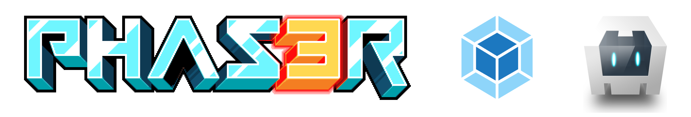

# phaser-3-webpack-cordova
A template boilerplate for making phaser 3 projects (could be other projects) and build them for android and ios (or browser) using Webpack and Cordova.



## Requirements
- [Node.js](https://nodejs.org/en/)
- [Cordova](https://cordova.apache.org/) (can be installed with `npm install -g cordova`)
- Optional, but recommended - [Yarn](https://yarnpkg.com/en/docs/install#mac-stable)

## Getting Started
Installation steps to set this template up and running.

### Install
#### Clone repo (and specify folder name)
```
git clone https://github.com/PeeJeeDR/phaser-3-webpack-cordova.git PROJECT_NAME
```

#### Navigate in folder
```
cd PROJECT_NAME
```

#### Remove git
```
rm -rf .git
```

#### Optional init own
```
git init
```

#### Install dependecies
```
yarn
```

### Available scripts
#### Start development server
```
yarn serve
```

On desktop visit http://localhost:8080 to open the project. In order to visit the project on another device (phone, ipad, etc.) you wil have to get the public ip address of your machine first. You can do this by running the following command (in new terminal):

**MAC**
```
yarn get-ip
```

Execute `ifconfig` if this doesn't work and find it there.

**WINDOWS**
```
ipconfig
```
Find your IPv4 address.

Now you can visit this ip address in the browser on your external device followed by the `:PORT`. (ex. http://192.168.1.5:8080)

**Make sure your devices are on the same network.**

#### Build the app
This will put the builded files in the `www` folder (used by Cordova)

```
yarn build
```

## Cordova
First update the config.xml to your preferences. (name, description, ...)

In this example I will use android as example. Change `android` to `ios` for iOS build.

**Make sure you ran `yarn build` at least once so that the `www` folder is present.**

#### Add prefered platform
```
cordova platform add android
```

#### Run app
```
cordova run android
```

This command will run an emalator on your machine if you have installed Android studio (Android) or XCode (iOS).
If your device is connected to your machine with a cable it should open there.

**NOTE: There is no live/hot reload with the `cordova run` command. Use `yarn serve` instead to test on your device.**

#### Build
```
cordova build android
```

#### Build release
```
cordova build --release android
```
